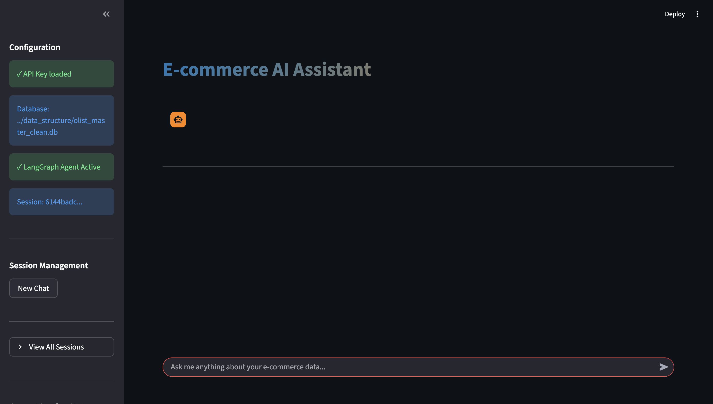

# 🛍️ Brazilian E-commerce Intelligence Platform
**AI-Powered Conversational Analytics with LangGraph**

> Built for Maersk AI/ML Internship Assignment - Transform complex e-commerce data into insights through natural language conversations.

---

## 📋 Overview

Query 119K+ e-commerce records using **plain English** - no SQL knowledge needed! Built with **Google Gemini AI** and **LangGraph**, this system automatically generates SQL queries, executes them, and provides conversational responses with full memory.

**Key Features:**
- 🤖 **Agentic AI**: LangGraph state machine with autonomous decision-making
- 💬 **Conversational Memory**: Remembers context across sessions (stores last 10 messages)
- 🎨 **ChatGPT-Style UI**: Purple gradient session cards with auto-generated names
- 💾 **Persistent Storage**: All chats saved to SQLite database
- 🗑️ **Session Management**: Create, load, and delete conversations
- 🗄️ **Unified Database**: 9 CSV files merged into single SQLite DB (119K records)

---


## 📸 Screenshots

### Chat Interface


### Session Management (ChatGPT-Style)


### SQL Query Display


### Context Aware Chat


## 🏗️ System Architecture

### High-Level Architecture

```
┌─────────────────────────────────────────────────────────────────┐
│                         USER LAYER                              │
│  ┌──────────────────────────────────────────────────────────┐   │
│  │            Streamlit Web Interface                       │   │
│  │  • Chat UI  • Session Cards  • Data Tables              │   │
│  └──────────────────────────┬───────────────────────────────┘   │
└─────────────────────────────┼───────────────────────────────────┘
                              ↓
┌─────────────────────────────────────────────────────────────────┐
│                    AGENTIC AI LAYER (LangGraph)                 │
│                                                                  │
│  ┌──────────┐   ┌──────────┐   ┌──────────┐   ┌──────────┐    │
│  │    🧠    │→→→│    ⚙️    │→→→│    🔍    │→→→│    📊    │    │
│  │UNDERSTAND│   │ GENERATE │   │ EXECUTE  │   │  FORMAT  │    │
│  │  Query   │   │   SQL    │   │  Query   │   │ Response │    │
│  └──────────┘   └──────────┘   └──────────┘   └──────────┘    │
│       ↓              ↓              ↓              ↓            │
│  └──────────────── ⚠️ ERROR HANDLER ────────────────┘          │
│          (Automatic Retry with improved query)                  │
│                                                                  │
│  State Management:                                              │
│  • Conversation history (last 10 messages)                      │
│  • Database schema cache                                        │
│  • Session context tracking                                     │
└─────────────────────────────┬───────────────────────────────────┘
                              ↓
┌─────────────────────────────────────────────────────────────────┐
│                       AI MODEL LAYER                            │
│  ┌──────────────────────────────────────────────────────────┐   │
│  │           Google Gemini 2.0 Flash                        │   │
│  │  • Temperature: 0.1 (deterministic)                      │   │
│  │  • Context window: 1M tokens                             │   │
│  │  • Task: Natural Language → SQL conversion              │   │
│  └──────────────────────────────────────────────────────────┘   │
└─────────────────────────────────────────────────────────────────┘
                              ↓
┌─────────────────────────────────────────────────────────────────┐
│                       DATA LAYER                                │
│  ┌─────────────────────────┐  ┌─────────────────────────────┐  │
│  │ olist_master_clean.db   │  │   chat_history.db           │  │
│  │ ───────────────────────  │  │ ──────────────────────────  │  │
│  │ • 119,143 records       │  │ • chat_sessions table       │  │
│  │ • 38 columns            │  │ • chat_messages table       │  │
│  │ • 58MB size             │  │ • Session names             │  │
│  │ • Indexed for speed     │  │ • Context memory            │  │
│  │                         │  │ • Timestamps                │  │
│  │ READ-ONLY queries       │  │ READ/WRITE operations       │  │
│  └─────────────────────────┘  └─────────────────────────────┘  │
└─────────────────────────────────────────────────────────────────┘
```

### LangGraph Workflow (Agentic Decision-Making)

**5-Node State Machine:**

```
                    User Question
                          ↓
              ┌───────────────────────┐
              │   🧠 UNDERSTAND NODE  │
              │                       │
              │  • Parse user intent  │
              │  • Load DB schema     │
              │  • Build context      │
              └───────────┬───────────┘
                          ↓
              ┌───────────────────────┐
              │   ⚙️ GENERATE NODE    │
              │                       │
              │  • Call Gemini API    │
              │  • Include context    │
              │  • Generate SQL       │
              │  • Validate syntax    │
              └───────────┬───────────┘
                          ↓
              ┌───────────────────────┐
              │   🔍 EXECUTE NODE     │
              │                       │
              │  • Connect to SQLite  │
              │  • Run SQL query      │
              │  • Fetch results      │
              │  • Handle errors      │
              └───────────┬───────────┘
                          ↓
              ┌───────────────────────┐
              │   📊 FORMAT NODE      │
              │                       │
              │  • Convert to text    │
              │  • Create DataFrame   │
              │  • Count records      │
              │  • Format response    │
              └───────────┬───────────┘
                          ↓
              ┌───────────────────────┐
              │   💾 SAVE NODE        │
              │                       │
              │  • Save to history    │
              │  • Update session     │
              │  • Generate name      │
              │  • Update timestamp   │
              └───────────┬───────────┘
                          ↓
                  Final Response
                          
                          
    ⚠️ ERROR NODE (triggered on any failure)
    ├─ Retry count < 2?
    │  ├─ YES → Return to GENERATE with error context
    │  └─ NO  → Return error message to user
    └─ Log error details
```


### CSV join workflow


### Data Flow Diagram
```
┌──────────────┐
│ 9 CSV Files  │ (Raw Kaggle Data)
└──────┬───────┘
       ↓
┌──────────────────────────────────────┐
│    process_data.py (ETL Pipeline)    │
│  • Load all CSVs                     │
│  • LEFT JOIN on foreign keys         │
│  • Aggregate payments                │
│  • Create derived columns            │
│  • Export to SQLite                  │
└──────┬───────────────────────────────┘
       ↓
┌──────────────────────────┐
│ olist_master_clean.db    │
│ (Master Database)        │
└──────┬───────────────────┘
       ↓
┌──────────────────────────────────────┐
│ migrate_database.py (Schema Update)  │
│  • Add session_name column           │
│  • Create chat_history.db            │
│  • Initialize tables                 │
└──────┬───────────────────────────────┘
       ↓
┌──────────────────────────┐
│  chat_history.db         │
│  (Session Storage)       │
└──────────────────────────┘
       ↓
┌──────────────────────────────────────┐
│  Streamlit App (langgraph_app.py)    │
│  ↓                                    │
│  LangGraph Agent (langgraph_agent.py)│
│  ↓                                    │
│  Gemini AI (SQL Generation)          │
│  ↓                                    │
│  Query Execution & Results           │
└──────────────────────────────────────┘
```

**Tech Stack:**
- **AI Model**: Google Gemini 2.0 Flash (temperature: 0.1)
- **Agent**: LangGraph with 5-node state machine
- **Database**: SQLite (master data + chat history)
- **UI**: Streamlit with ChatGPT-style interface
- **Language**: Python 3.13
└── README.md                        # This file
```

---

## 🔄 Data Pipeline: From 9 CSVs to Unified Database

### Step 1: Source Data (9 CSV Files)
The Brazilian E-commerce dataset contains **9 separate CSV files**:
1. `olist_orders_dataset.csv` - Order information
2. `olist_customers_dataset.csv` - Customer details
3. `olist_products_dataset.csv` - Product catalog
4. `olist_sellers_dataset.csv` - Seller information
5. `olist_order_items_dataset.csv` - Items in each order
6. `olist_order_payments_dataset.csv` - Payment methods
7. `olist_order_reviews_dataset.csv` - Customer reviews
8. `olist_geolocation_dataset.csv` - Location data
9. `product_category_name_translation.csv` - Category translations

### Step 2: Data Processing (`data_structure/process_data.py`)

**How the 9 CSVs are Joined:**

```
Orders (base table)
  ├── LEFT JOIN Customers (on customer_id)
  ├── LEFT JOIN Order Items (on order_id)
  │     └── LEFT JOIN Products (on product_id)
  │     └── LEFT JOIN Sellers (on seller_id)
  ├── LEFT JOIN Payments (on order_id) - aggregated
  ├── LEFT JOIN Reviews (on order_id)
  └── LEFT JOIN Geolocation (on customer zip code)
```


**Processing Steps:**
1. **Load all 9 CSV files** into pandas DataFrames
2. **Aggregate payment data** (multiple payments per order → single total)
3. **Join tables sequentially** using primary/foreign keys
4. **Create derived features**:
   - `delivery_delay_days` = actual delivery - estimated delivery
   - `is_delayed` = boolean flag for late deliveries
   - `order_total` = sum of all items + freight
5. **Clean and optimize** data types
6. **Export to SQLite database** with indexes

**Output:** `olist_master_clean.db` - 119,143 records, 38 columns, 58MB


*Add screenshot showing the table relationships*

### Step 3: Why SQLite Database?

✅ **Fast Queries**: 10-50x faster than reading CSVs  
✅ **SQL Support**: Complex joins, aggregations, and filters  
✅ **Indexed Searches**: Instant lookups on 119K records  
✅ **Production-Ready**: Industry-standard database  
✅ **No Setup**: Works without database server

---

## � Project Structure

```
AP_moller_assignment/
├── data_structure/
│   ├── process_data.py              # Merges 9 CSVs into SQLite database
│   ├── olist_master_clean.db        # Master database (119K records)
│   └── [9 CSV files]                # Raw source data
│
├── final_site/
│   ├── langgraph_agent.py           # LangGraph agent + memory system
│   ├── langgraph_app.py             # Streamlit UI + session mgmt
│   ├── migrate_database.py          # DB schema migration tool
│   ├── chat_history.db              # Session storage (auto-created)
│   └── .env                         # GEMINI_API_KEY
│
└── README.md                        # This file
```

---

---

## 🛠️ Technologies Used

| Component | Technology | Purpose |
|-----------|-----------|---------|
| AI Model | Google Gemini 2.0 Flash | SQL generation & NL understanding |
| Agent Framework | LangGraph | State machine workflow |
| Database | SQLite | Data storage & queries |
| Frontend | Streamlit | Chat interface |
| Data Processing | Pandas | CSV to database pipeline |
| Language | Python 3.13 | Core application |

---


## 🔄 Data Pipeline: 9 CSVs → Unified Database

### Source Data (9 CSV Files):
1. `olist_orders_dataset.csv` - Order information
2. `olist_customers_dataset.csv` - Customer details  
3. `olist_products_dataset.csv` - Product catalog
4. `olist_sellers_dataset.csv` - Seller information
5. `olist_order_items_dataset.csv` - Items in each order
6. `olist_order_payments_dataset.csv` - Payment methods
7. `olist_order_reviews_dataset.csv` - Customer reviews
8. `olist_geolocation_dataset.csv` - Location data
9. `product_category_name_translation.csv` - Category translations

### How They're Joined (`process_data.py`):
```
Orders (base table)
  ├── LEFT JOIN Customers (on customer_id)
  ├── LEFT JOIN Order Items (on order_id)
  │     ├── LEFT JOIN Products (on product_id)
  │     └── LEFT JOIN Sellers (on seller_id)
  ├── LEFT JOIN Payments (on order_id) - aggregated
  ├── LEFT JOIN Reviews (on order_id)
  └── LEFT JOIN Geolocation (on customer zip code)

Result: olist_master_clean.db
- 119,143 records
- 38 columns
- 58MB size
- Indexed for fast queries
```

---

## 🚀 Quick Start

### Prerequisites
- Python 3.11+ 
- 500MB disk space
- [Gemini API Key](https://aistudio.google.com/apikey) (free)

### Installation

**1. Install Dependencies**
```bash
pip install streamlit pandas langchain langgraph langchain-google-genai python-dotenv
```

**2. Setup API Key**
Create `.env` file in `final_site/`:
```bash
GEMINI_API_KEY=your_api_key_here
DB_PATH=../data_structure/olist_master_clean.db
```

**3. Generate Database** (First time only)
```bash
cd data_structure
python process_data.py
# Creates olist_master_clean.db from 9 CSVs
```

**4. Run Migration** (Important!)
```bash
cd final_site
python migrate_database.py
# Adds session_name column for  naming
```

**5. Start Application**
```bash
streamlit run langgraph_app.py
```

Open browser: **http://localhost:8501**

---

## 💡 Example Queries

**Business Questions:**
- "What are the top 10 product categories by revenue?"
- "Show me monthly sales trends"
- "Which states have the highest order concentration?"
- "What's the average delivery delay by state?"

**Conversational Follow-ups:**
- "Show me only the top 5"
- "What's the average for those?"
- "Filter by São Paulo only"
- "Compare those with Rio de Janeiro"

**Operational Insights:**
- "How many orders were delayed?"
- "What's the most popular payment method?"
- "Show me orders with review score below 3"

---

## 🎯 What Makes This Special

### 1. **True Conversational Memory**
- Loads last 10 messages from database automatically
- Context persists even after page refresh
- Understands "those", "them", "these results"

### 2. **Production-Ready Architecture**
- LangGraph state machine (not simple LLM calls)
- Persistent storage in SQLite
- Error recovery with retry logic
- Session management system

### 3. **ChatGPT-Like Experience**
- Auto-generated session names
- Beautiful gradient UI
- Load/delete conversations
- Timestamp tracking

---

## 🛠️ Technologies

| Component | Technology |
|-----------|-----------|
| AI Model | Google Gemini 2.0 Flash |
| Agent Framework | LangGraph (5-node state machine) |
| Database | SQLite |
| Frontend | Streamlit |
| Language | Python 3.13 |

---

## 📄 License

Educational project for Maersk AI/ML Internship Assignment.
```

---

## 🚀 Quick Start

### Step 1: Clone the Repository

```bash
# Clone from GitHub
git clone 

# Navigate to project directory
cd AP_Moller_assignment
```


### Step 2: Set Up Python Environment

**Option A: Using Virtual Environment (Recommended)**
```bash
# Create virtual environment
python3 -m venv .venv

# Activate virtual environment
# On macOS/Linux:
source .venv/bin/activate

# On Windows:
.venv\Scripts\activate
```

**Option B: Using Conda**
```bash
conda create -n ecommerce-ai python=3.11
conda activate ecommerce-ai
```

### Step 3: Install Dependencies

```bash
pip install -r requirements.txt
```

**Required packages installed:**
- `streamlit` (v1.39.0) - Web interface
- `pandas` (v2.2.3) - Data processing
- `langchain` (v0.3.7) - AI framework core
- `langgraph` (v0.2.45) - Agentic workflow engine
- `langchain-google-genai` (v2.0.5) - Google Gemini integration
- `google-generativeai` (v0.8.3) - Gemini API client
- `python-dotenv` (v1.0.1) - Environment variables
- `sqlalchemy` (v2.0.36) - Database toolkit

### Step 4: Configure API Key

**Get your Gemini API key:**
1. Visit [Google AI Studio](https://aistudio.google.com/apikey)
2. Sign in with your Google account
3. Click "Create API Key"
4. Copy the generated key

**Create `.env` file:**
```bash
cd final_site
cp .env.example .env
```

**Edit `.env` file** and add your API key:
```bash
GEMINI_API_KEY=your_actual_api_key_here
DB_PATH=../data_structure/olist_master_clean.db
```

> ⚠️ **Security:** Never commit the `.env` file to GitHub! It's already in `.gitignore`.

### Step 5: Generate Master Database

This step creates the unified database from 9 CSV files (one-time setup):

```bash
# Navigate to data_structure folder
cd ../data_structure

# Run the data processing script
python process_data.py
```

**What happens:**
- Reads 9 CSV files from Kaggle dataset
- Performs data joins and cleaning
- Creates `olist_master_clean.db` (119K records, 58MB)
- Indexes tables for fast querying

**Expected output:**
```
Processing data...
✓ Loaded 9 CSV files
✓ Joined tables on foreign keys
✓ Created master database: olist_master_clean.db
✓ Database size: 58 MB
```

### Step 6: Initialize Chat Database

Run the database migration to set up chat history storage:

```bash
# Navigate to final_site folder
cd ../final_site

# Run migration script
python migrate_database.py
```

**What this does:**
- Creates `chat_history.db` with proper schema
- Adds `chat_sessions` table (stores session metadata)
- Adds `chat_messages` table (stores conversation history)
- Adds `session_name` column for ChatGPT-style naming
- Safe to run multiple times (idempotent)

**When to run:**
- ✅ First time setup
- ✅ After pulling updates from GitHub
- ✅ If you see "no such column: session_name" error

### Step 7: Launch the Application

```bash
# Make sure you're in final_site folder
streamlit run langgraph_app.py
```

**Expected output:**
```
  You can now view your Streamlit app in your browser.

  Local URL: http://localhost:8501
  Network URL: http://192.168.x.x:8501
```

**Open your browser** and navigate to: **http://localhost:8501**

### 🎉 Success! You should see:
- 🟣 Purple chat interface
- 💬 "Ask me anything about the e-commerce data..." prompt
- 📂 Sidebar with session management
- ✨ Ready to answer questions in natural language

---

## 🔄 Running After Initial Setup

Once you've completed the setup, subsequent runs only need:

```bash
# 1. Activate environment
source .venv/bin/activate  # or conda activate ecommerce-ai

# 2. Navigate to final_site
cd final_site

# 3. Run the app
streamlit run langgraph_app.py
```

---

## 🐛 Troubleshooting

### Issue: "No module named 'streamlit'"
**Solution:** Make sure virtual environment is activated and dependencies are installed:
```bash
source .venv/bin/activate
pip install -r requirements.txt
```

### Issue: "GEMINI_API_KEY not found"
**Solution:** Check that `.env` file exists in `final_site/` folder with valid API key:
```bash
cd final_site
cat .env  # Should show: GEMINI_API_KEY=your_key
```

### Issue: "Database file not found"
**Solution:** Run the data processing script:
```bash
cd data_structure
python process_data.py
```

### Issue: "no such column: session_name"
**Solution:** Run the migration script:
```bash
cd final_site
python migrate_database.py
```

### Issue: Port 8501 already in use
**Solution:** Stop existing Streamlit process or use different port:
```bash
streamlit run langgraph_app.py --server.port 8502
```

---

## 💡 Example Queries

Try asking these questions:

**Business Analytics:**
- "What are the top 10 product categories by revenue?"
- "Show me monthly sales trends"
- "Which states have the highest customer concentration?"

**Operational Insights:**
- "How many orders were delayed in 2018?"
- "What's the average delivery time by state?"
- "Show me orders with review score below 3"


---

## ✨ Key Features

### 1. 💬 **Conversational Memory** (NEW!)
- **Context Awareness**: AI remembers last 10 messages from database
- **Follow-up Questions**: "Show me more about those", "What's the average?"
- **Persistent Memory**: Context survives page refresh
- **Session Restoration**: Load old conversations with full context

Example:
```
You: "What are top 5 states by sales?"
AI: [Shows SP, RJ, MG, RS, PR]

You: "What's the average delivery time for those?"
AI: [Automatically queries same 5 states - remembers context!]
```

### 2. 🎨 **ChatGPT-Style Session Management** (NEW!)
- **Auto-Generated Names**: Session names from first message (e.g., "What are top 5 states")
- **Purple Gradient Cards**: Modern UI with hover effects
- **Session Metadata**: Shows timestamp & message count
- **Load Sessions**: 📂 Click to restore any conversation
- **Delete Sessions**: 🗑️ Remove unwanted conversations
- **Active Protection**: Can't delete session you're currently using

### 3. 🤖 **Smart SQL Generation**
- AI generates optimized SQLite queries
- Validates syntax before execution
- Prevents dangerous operations (DELETE, DROP)
- Shows generated SQL for transparency

### 4. 📊 **Interactive Results**
- Responsive data tables
- CSV export functionality
- Record count display
- Mobile-friendly design

### 5. 🔄 **Error Recovery**
- Automatic retry (max 2 attempts)
- Clear error messages
- Query reformulation on failures

---

## 📁 Project Structure

```
AP_moller_assignment/
├── data_structure/
│   ├── process_data.py              # Merges 9 CSVs → SQLite
│   ├── olist_master_clean.db        # Master DB (119K records, 58MB)
│   └── [9 CSV files]                # Raw Kaggle data
│
├── final_site/
│   ├── langgraph_agent.py           # LangGraph agent + memory system
│   ├── langgraph_app.py             # Streamlit UI + session mgmt
│   ├── migrate_database.py          # DB schema migration tool
│   ├── chat_history.db              # Session storage (auto-created)
│   └── .env                         # GEMINI_API_KEY
│
└── README.md                        # This file
```

---

## 🎯 Technical Highlights

### LangGraph Agentic System
Unlike traditional chatbots, this uses an **autonomous agent** that:
- Makes decisions based on context
- Self-validates queries before execution
- Recovers from errors automatically
- Maintains conversation state

### Why LangGraph?
- **Modularity**: Each node (understand, generate, execute, format) is independent
- **Reliability**: Built-in error handling and retry logic
- **Scalability**: Easy to add new capabilities (e.g., chart generation)
- **Transparency**: Full visibility into agent's decision process

### Database Migration System
The `migrate_database.py` script ensures schema compatibility:

**Features:**
- **Schema Versioning**: Automatically updates database structure
- **Idempotent**: Safe to run multiple times without side effects
- **Backward Compatible**: Preserves existing data during migration
- **Smart Detection**: Checks if migration is needed before executing

**How it works:**
```python
# 1. Check if column exists
PRAGMA table_info(chat_sessions)

# 2. Add column if missing
ALTER TABLE chat_sessions ADD COLUMN session_name TEXT

# 3. Populate existing records
UPDATE chat_sessions 
SET session_name = 'Conversation ' || substr(session_id, 1, 8)
WHERE session_name IS NULL
```

**Use cases:**
- Schema updates between app versions
- Adding new features (like session naming)
- Database structure evolution

### Performance
- **Query Response**: <5 seconds average
- **Database Size**: 58MB (119K records)
- **Concurrent Users**: Supports multiple sessions
- **Uptime**: Streamlit auto-restart on errors

---


---

## 🔒 Security & Best Practices

✅ **Environment Variables**: API keys never hardcoded  
✅ **SQL Injection Prevention**: Parameterized queries only  
✅ **Read-Only Access**: No DELETE/DROP/ALTER allowed  
✅ **Input Validation**: All user inputs sanitized  
✅ **Error Handling**: Graceful degradation on failures

---

## 🛠️ Technologies Used

| Component | Technology | Purpose |
|-----------|-----------|---------|
| AI Model | Google Gemini 2.0 Flash | SQL generation & NL understanding |
| Agent Framework | LangGraph | State machine workflow |
| Database | SQLite | Data storage & queries |
| Frontend | Streamlit | Chat interface |
| Data Processing | Pandas | CSV to database pipeline |
| Language | Python 3.13 | Core application |

---

## 📝 Future Enhancements

- 📊 **Data Visualization**: Auto-generate charts from results
- 🔍 **Advanced Filters**: Date ranges, multi-column filters
- 📤 **Export Options**: PDF reports, Excel exports
- 🌐 **Multi-language**: Support Portuguese queries
- 📈 **Analytics Dashboard**: Pre-built KPI widgets

---

## 👤 Author

**Built for Maersk AI/ML Internship Assignment**

This project demonstrates:
- ✅ Production-ready GenAI application
- ✅ Agentic AI system with LangGraph
- ✅ End-to-end data pipeline
- ✅ Modern UI/UX design
- ✅ Best practices in security & architecture

---

## 📄 License

Educational project for internship assignment evaluation.

